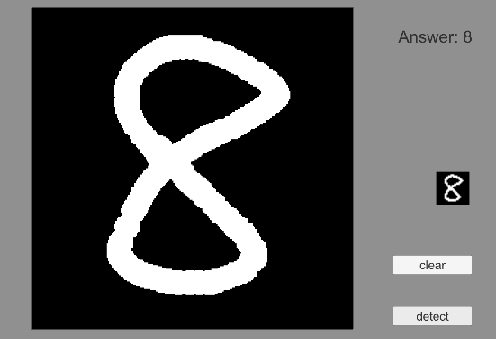

# UnityTensorFlowCNNTest
This is an example code of a CNN for MNIST handwritten digit recognition with Unity Tensorflow at runtime. 
The Tensorflow code is based on "https://github.com/jzharris/Unity-MNIST". 
Please don't forget to add the Unity Tensorflow.
 

